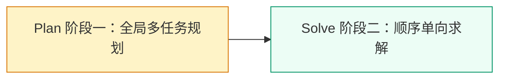
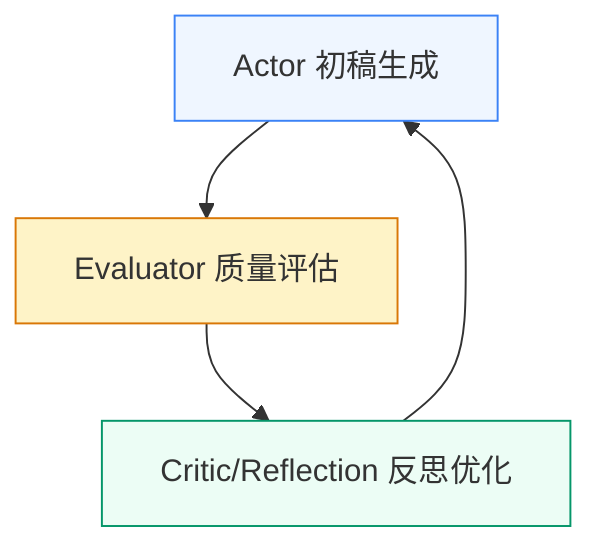
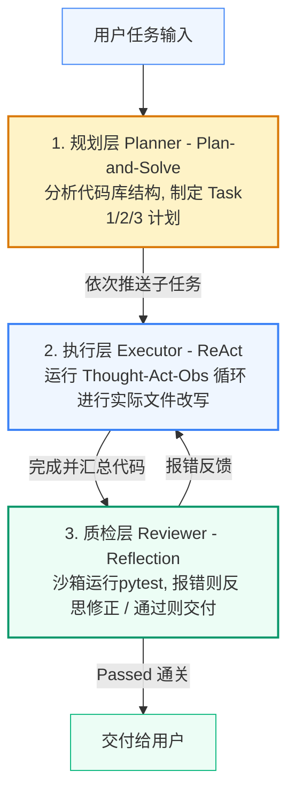

## 一、 认知组织三大范式

在智能体开发中，“思考（Reasoning，大脑）”与“行动（Acting，手脚）”的组织与协同方式决定了智能体的行为模式与能力边界。

### 📌 1. ReAct (Reasoning + Acting) —— 动态探索者

* **核心隐喻**：走一步，看一步。
* **控制流拓扑**：**紧耦合、实时在线的双向反馈环。**

* **运行逻辑**：
    模型在每一步决策前进行自我推理（Thought），输出一个需要调用的工具和参数（Action），等待真实外部系统运行该工具并返回真实结果（Observation）后，将反馈信息拼接入历史上下文，再决定下一步做什么。
* **✅ 优势**：极强的动态纠错能力。工具报错后模型能自主换个方式重试，适合解决环境多变、充满未知的探索性任务。
* **❌ 局限**：高延迟（每一轮思考和行动都是串行交互）、高 Token 消耗（上下文历史随循环呈指数级增长）、容易陷入无限死循环（Looping）。
* **💡 最佳适用场景**：网络搜索、数据库动态查询、自动化网页浏览器、环境控制器。

---

### 📌 2. Plan-and-Solve (规划与求解) —— 全局规划者

* **核心隐喻**：想好了，再动手。
* **控制流拓扑**：**彻底解耦、严格时间先后的阶段性流控制。**

* **运行逻辑**：
    在面对复杂的多步骤问题时，不急于立刻执行。
  * **第一阶段（Plan）**：模型在虚拟的上下文中完成对已知条件的提取、对终极目标的理解，并将复杂任务拆解为若干个具体的、可执行的子任务清单（路线图）。
  * **第二阶段（Solve）**：模型作为执行器，严格、机械、高精度地沿着路线图逐步解题并核对，直至输出最终答案。
* **✅ 优势**：极大降低复杂逻辑任务中的“步骤遗漏”和“中途迷失”概率。执行流程确定，单次或极少次 API 交互即可输出，成本极低、延迟低。
* **❌ 局限**：容错能力较弱。由于属于“离线规划”，如果在第一步制定计划时由于理解错误设计了错误的路线，后续执行阶段会一错到底。
* **💡 最佳适用场景**：数学题求解、复杂算法逻辑设计、长文本关键字段提取、多源信息聚合对比。

---

### 📌 3. Reflection (自我反思) —— 质量把控者

* **核心隐喻**：写完初稿，严加校对。
* **控制流拓扑**：**多角色协同、异步评估的渐进式优化闭环。**

* **运行逻辑**：
  * **生成阶段（Actor）**：根据输入生成初版草稿。
  * **评估阶段（Evaluator）**：通过静态代码扫描、真实单元测试（外部评估）或由大模型本身检测逻辑错误（内部评估），捕获具体的报错信息或缺陷。
  * **反思阶段（Critic）**：将草稿与报错信息结合，定位根本原因，给出具体的重构指令。
  * **重构阶段（Actor）**：带着修改指令重新生成，直到评估完全通过。
* **核心模式分类**：
    1. **单模型自我修正**：由同一个模型在同一个对话会话中轮流扮演生成者和质检者。
    2. **双模型对抗审校**：由富有创意的 Writer 模型和极其严苛的安全审计/高级架构师 Reviewer 模型（通常使用更强大的模型）进行对抗式校对。
    3. **环境反馈内省（沙箱反射）**：**代码类 Agent 的核心**。通过在后台真实隔离的 Docker 容器中运行单元测试，将 traceback 报错信息作为反馈喂回大模型进行自动排错。
* **✅ 优势**：将大模型的输出质量拔高到商用级，能够自动消灭拼写错误、未导入包、边界缺失等低级 Bug。
* **❌ 局限**：Token 成本极高（每一轮重构都意味着全量文本重写），累积延迟很高。
* **💡 最佳适用场景**：代码生成与自动除错（Auto-Debugging）、高标法律合同审计、专业公关文案精细润色。

---

## 二、 三大范式认知拓扑对比表

| 维度 | ReAct | Plan-and-Solve | Reflection |
| :--- | :--- | :--- | :--- |
| **思维与动作关系** | **脑手同步**：边做边想，高度震荡。 | **脑先手后**：想好再做，单向流动。 | **手做脑评**：做完再改，异步迭代。 |
| **环境反馈依赖** | **极高**（每一步都依赖真实环境反馈） | **极低**（完全依赖上下文和内在推理） | **中到高**（依赖外部测试框架或审校模型） |
| **执行延迟 (Latency)**| 高（多轮交互） | 极低（通常单轮输出） | 较高（多轮循环打磨） |
| **Token 运行成本** | 较高（上下文记忆链不断拉长） | 极低（单轮大窗口吞吐） | 极高（每次修改均要重构完整输出） |
| **核心解决痛点** | 客观环境充满未知，需要动态探索。 | 任务极其复杂，容易遗漏步骤或跑偏。 | 产出物要求零瑕疵，需要极致质量控制。 |

---

## 三、 工业级混合范式架构设计实践

在实际商业化落地中，纯粹只使用单一范式往往难以应付现实场景的复杂度。真正的商用 Agent 往往使用“混合范式（Hybrid Paradigm）”，将三种范式拼装进一套确定性的软件工程流水线。

### ⚙️ 案例 1：智能代码助手（Planner-Executor-Reviewer 架构）

本架构被 Devin、Claude Code、Aider 等顶尖代码智能体广泛采用。

---

### ⚙️ 案例 2：电商“退款客服”智能体（合规与风控闭环）

针对电商场景中退款涉及的资金安全、合规标准与品牌形象问题，设计了如下混合流程：

#### 1. 业务功能需求

* 理解用户退款申请理由。

* 查询订单信息与物理包裹状态。
* 结合退换货政策判断是否批准。
* 自动派发得体的邮件通知。
* 过滤出存在争议的模糊案例，进行置信度反思，必要时转接人工审核。

#### 2. 三范式拼装链路

1. **全局 SOP 约束（Plan-and-Solve）**：
    收到用户纠纷后，第一阶段禁止模型直接进行退款操作。强制模型列出服务标准作业程序（SOP）计划：
    * 步骤 1：调用工具查询订单实付金额和物流签收时间。
    * 步骤 2：使用语义检索工具（RAG）匹配对应的商家退换货政策。
    * 步骤 3：进行条件核对，计算是否可退，核定退款金额。
    * 步骤 4：生成告知邮件草稿。
2. **异常捕获执行（ReAct）**：
    在执行“步骤 1（查询订单和物流）”时，大模型需要通过 ReAct 调用 `QueryOrderAndLogistics` 工具，在网络超时或订单号存在输入歧义时，模型通过 `Observation` 进行自适应调整，避免程序崩溃。
3. **风控与公关审计（Reflection）**：
    在模型完成步骤 3 和步骤 4 后，进入质检关卡：
    * **决策置信度自省**：模型对自己的退款判定计算置信度（Confidence Score）。如果判定处于模糊地带（如：商品超期 1 天，但物流在途延迟了 4 天），自省得分低于安全阈值 0.8，触发反思器挂起任务，生成详尽的审计报告并自动推送到人工客服后台处理。
    * **内容安全与语气审计**：在最终向用户发送邮件前，启动一个严格的“质检 Prompt”，审查生成的邮件是否带有温度、是否泄露系统隐私，确认安全后再调用 `SendCustomerEmail` 工具。

#### 3. 必备系统工具清单

* **订单物流综合查询工具 (`Query_Order_and_Logistics`)**：
  * **功能**：连接内部订单数据库及快递 100 API，输入订单号返回其购买时间、实付金额、是否拆封、物流状态及签收时间。
* **政策检索检索工具 (`Search_Refund_Policy` - RAG)**：
  * **功能**：基于向量数据库，匹配最相似的商家售后政策和行业法规，为决策阶段提供绝对合规的客观事实依据。
* **企业级邮件发送工具 (`Send_Customer_Email`)**：
  * **功能**：通过内部 SMTP 邮件网关自动派发美观、得体的 HTML 客服告知邮件。

---

## 四、 智能体架构师黄金设计法则

> ### 🚫 1. 不要在不确定的环境里指望静态计划
>
> 只要涉及到需要读写外部文件、查询变动的网络、或者控制物理硬件的操作，必须使用 ReAct 这种带有动态碰撞和纠偏的回路。

> ### 🗺️ 2. 不要在庞大长程任务中依赖纯自由自主
>
> 大模型的注意力会因上下文窗口拉长而稀释。长程业务必须首先用 Plan-and-Solve 将其骨架化、确定化。

> ### 🛡️ 3. 永远在资金、代码、公关出口设立 Reflection 关卡
>
> 在将大模型的产出物真实呈现给用户、或者是执行真实资金转移、代码提交之前，必须部署独立的 Reflection 机制，用运行环境的客观报错，或者用高规格的 Critic 角色对其进行“降噪和风控”。
