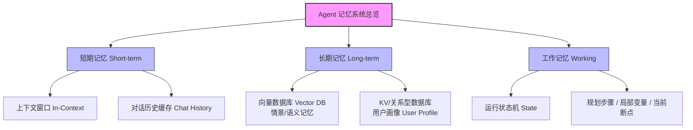
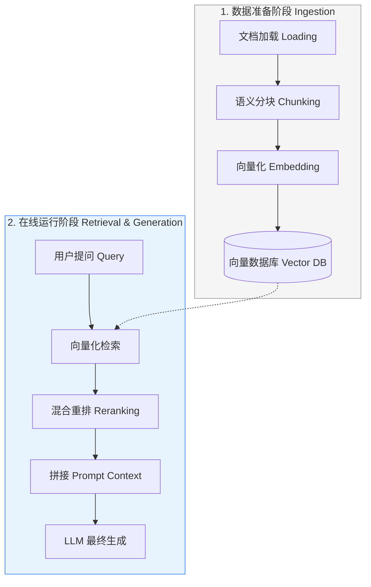
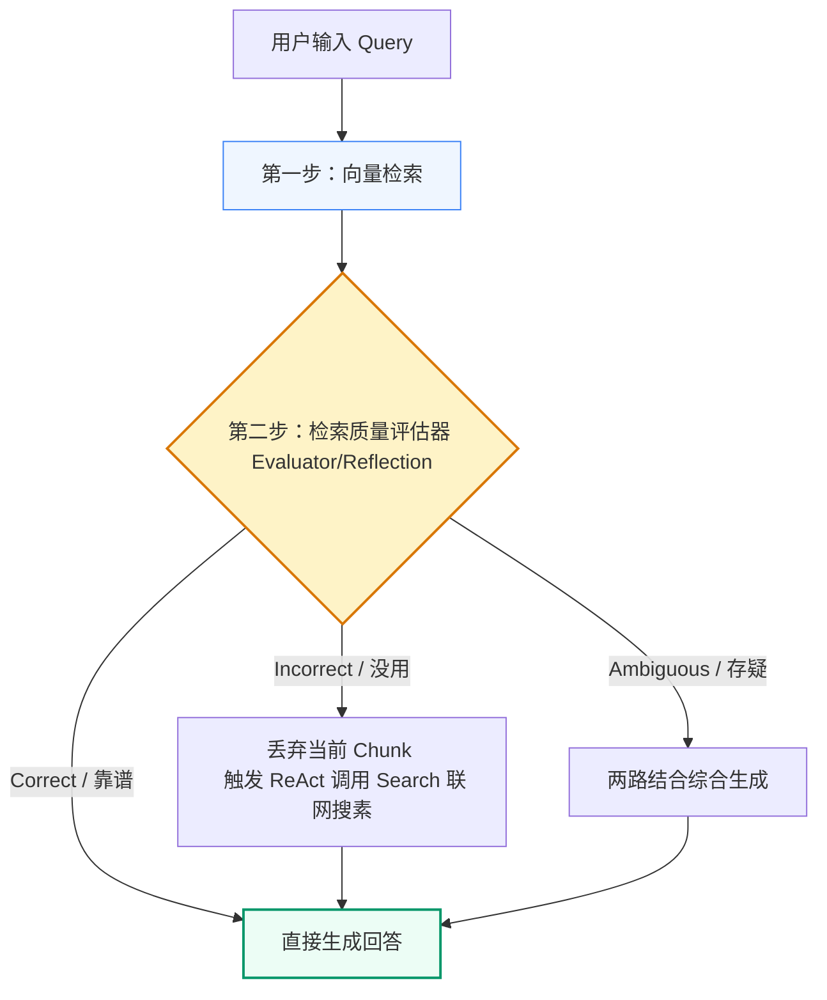

## 一、 AI Agent 记忆（Memory）体系

大语言模型（LLM）底层是**无状态（Stateless）**的。为了让智能体具备行为的连续性、个性化和自我进化能力，必须在外围建立一套模拟人类认知机制的记忆工程系统。

### 📌 1. 记忆的三大认知维度与 AI 映射

智能体的记忆体系深度借鉴了人类心理学的认知分类：

* **短期记忆（Short-term Memory）**：
  * **人类类比**：瞬时感知，如你正读到这一行字。
  * **AI 映射**：**上下文窗口（Context Window）**。
  * **物理本质**：将最近几轮的对话历史（Chat History）作为 `messages` 数组直接塞给 API，由模型在单次推理中进行注意力计算。
* **长期记忆（Long-term Memory）**：
  * **人类类比**：脑海中储存的陈述性常识、个人经历、朋友喜好。
  * **AI 映射**：**外部持久化数据库**。
    * **情景记忆（Episodic Memory）**：记录 Agent 过去与用户的真实交互片段，存储在向量数据库（Vector DB）中，根据语义相关性检索唤醒。
    * **语义记忆（Semantic Memory）**：静态百科知识与专业文档，通常通过 RAG 载入。
    * **用户画像（User Profile）**：结构化的非易失性特征数据（如年龄、邮箱、习惯），通常存储在 Redis、PostgreSQL 等数据库中。
* **工作记忆（Working Memory）**：
  * **人类类比**：解复杂数学题时，草稿纸上记录的中间推理过程与临时变量。
  * **AI 映射**：SOP（标准作业程序）工作流中智能体运行的**临时状态（State）**。
  * **典型代表**：`LangGraph` 的全局只增 State。它记录了当前计划执行到第几步、已算出的中间参数，任务结束后通常进行销毁或选择性归档。

---

### ⚙️ 2. 短期记忆（对话历史）的四大管理策略

在实际开发中，如果将对话历史一字不漏地传给大模型，Token 费用会呈指数增长。为此，工程上发展出了以下四种对话历史管理策略：

| 记忆模式 | 工作机制 | ✅ 优势 | ❌ 局限 |
| :--- | :--- | :--- | :--- |
| **全量缓存** (Buffer Memory) | 不加过滤，把所有对话历史完整地拼接进 `messages` 数组。 | 保持绝对的上下文连贯，代码实现极简。 | Token 成本极高，极易撞上 Context 限制。 |
| **滑动窗口** (Window Memory) | 设定阈值 $K$，只保留最近的 $K$ 轮对话，丢弃更早的交互。 | 成本绝对可控，推理首字延迟低。 | 模型会发生“记忆断崖式丢失”，忘记 $K$ 轮前的事实。 |
| **记忆摘要压缩** (Summary Memory) | 当 Token 满时，调用轻量级模型对老历史进行**摘要总结（Summarization）**并保存在 Prompt 开头，随后清空原始老对话。 | 极大节省了 Token 费用，同时保留了远期对话的主线记忆。 | 属于**有损压缩**，细节、语气、精确参数（如订单号）在摘要中会彻底丢失。 |
| **语义检索缓存** (Retrieval Memory) | 每一轮对话完结后存入向量数据库。用户提问题时，先去向量库进行语义检索，只把最相关的“历史回忆片段”拼接进 Prompt 中。 | 最符合人类的记忆唤醒机制（只有问到相关话题，才会回忆相关往事），Token 利用率极高。 | 每次提问都需要多进行一次向量检索，增加了首字延迟。 |

---

## 二、 工业级 RAG（检索增强生成）流水线

RAG 将大模型的任务从“闭卷考试（全凭参数脑补，极易产生事实幻觉）”升级为了“**开卷考试（先查阅权威资料，再根据资料组织回答）**”，是解决企业私有数据隐私与消除幻觉的核心。

### 📌 1. 标准 RAG 工业级生命周期

---

### ⚙️ 2. 进阶 RAG（Advanced RAG）三大工程优化技术

基础的 RAG（直接按字数切片 ➡️ 向量检索 ➡️ 生成）极易遇到“检索不到正确信息”或“检索到了但模型没看懂”的问题。以下是业界公认的标准优化技术：

#### 🔍 A. 文本分块策略（Chunking Strategy）

* **滑动窗口切分**：相邻文本块保留 10% ~ 20% 的**重叠区域（Overlap）**，确保跨边界语义不被强行切断。
* **父子分块（Parent-Child Chunking）**：
  * **痛点**：小段落（子块）向量特征突出，检索精度高，但喂给模型时因缺乏上下文而使模型看不懂；大段落（父块）上下文丰富，但向量化后特征被稀释，检索相似度极低。
  * **解法**：在向量库里存储**子块向量**用于检索。一旦子块被检索命中，系统**自动通过 ID 提取其背后的“父块全文”**作为 Context 喂给大模型（**检索用小块，生成用大块**）。

#### 🔀 B. 混合检索（Hybrid Search）

* **向量检索（Dense Retrieval）**：擅长理解模糊的概念和近义词关联，但不擅长匹配特定型号、货号、英文简写。
* **词频检索（Sparse Retrieval，如 BM25）**：经典的关键字精确搜索。擅长精确匹配编码和专业词汇，但无法理解同义词。
* **混合检索**：双路并发检索。通过 **RRF（Reciprocal Rank Fusion，倒数排名融合）** 算法合并两个渠道的排名，得出兼顾“深度语义”与“精确词汇匹配”的最终最优结果。

#### 📊 C. 重排机制（Reranking）

* **痛点**：向量近似检索（ANN）为了追求速度，Top-K 结果顺序并不十分精准；且大模型存在“迷失在中间（Lost in the Middle）”现象，会忽略夹在上下文中间的段落。
* **解法**：在向量库粗筛出 50 个 Chunk 后，引入 **Reranker 模型**（交叉编码器，如 BGE-Reranker）。它将 Query 和每一个 Chunk 放在一起进行深度的注意力计算，输出精度极高的二次相关性评分，重新精筛出前 5 个最相关的 Chunk 喂给大模型。

---

### 💎 3. 智能体时代：RAG 与 Agent 范式的融合（Agentic RAG）

在单兵 RAG 阶段，RAG 只是一个静态的知识库查询工具。而当 RAG 遇上 Agent 的 **ReAct 和 Reflection 范式** 后，就升级为了具备动态决策与纠错能力的 **CRAG（Corrective RAG，纠错检索增强生成）**：

---

## 三、 记忆与 RAG 的架构级工程设计法则

在构建企业级智能体应用时，数据架构师应严格遵循以下工程法则：

> ### 🚀 1. “静态先，动态后”的 Prompt 架构
>
> 为了最大化榨取**提示词缓存（Prompt Caching）**的威力（降低 80% 的预填充成本），必须将固定的 System Message、Few-shot 示例、固定的 Tools 声明放在 Prompt 最前面，将动态变化的 RAG 检索结果和用户当前提问放在最末尾。

> ### 📏 2. 避免“长上下文模型”的心智懒惰
>
> 虽然许多模型宣称支持 128k 甚至更高的上下文，但在生产环境下，将整本书/整份代码库直接塞入 Prompt 会带来高达数秒的**首字延迟（TTFT）**、高昂的 Token 费用，以及高达 30% 左右的注意力流失（Lost in the Middle）。**高精度、低能耗的 RAG 粗筛 + 小上下文模型**依然是工业落地的高性价比解法。

> ### ♻️ 3. 记忆的垃圾回收机制（Garbage Collection）
>
> 记忆和 RAG 的语料绝非越多越好。无意义的口水话（如“哈哈”、“在吗”）写入向量库会成为严重的检索噪声。在设计生产级记忆链时，需要引入 **GC（垃圾回收）过滤机制**，只将提取出的事实信息、最终的决策结果、User Profile 写入长期记忆。

> ### 🧠 4. 工作记忆（State）与短期记忆（Chat History）的合理分工
>
> 在编排复杂 Agent 工作流（如 LangGraph）时，绝对不要指望大模型通过“阅读长长的对话历史”来猜测接下来该干嘛。**下一步骤的控制权应该显式地固化在工作记忆（State 结构体）的变量中**。大模型只负责执行特定状态节点的任务，而不是自己去猜测状态。
