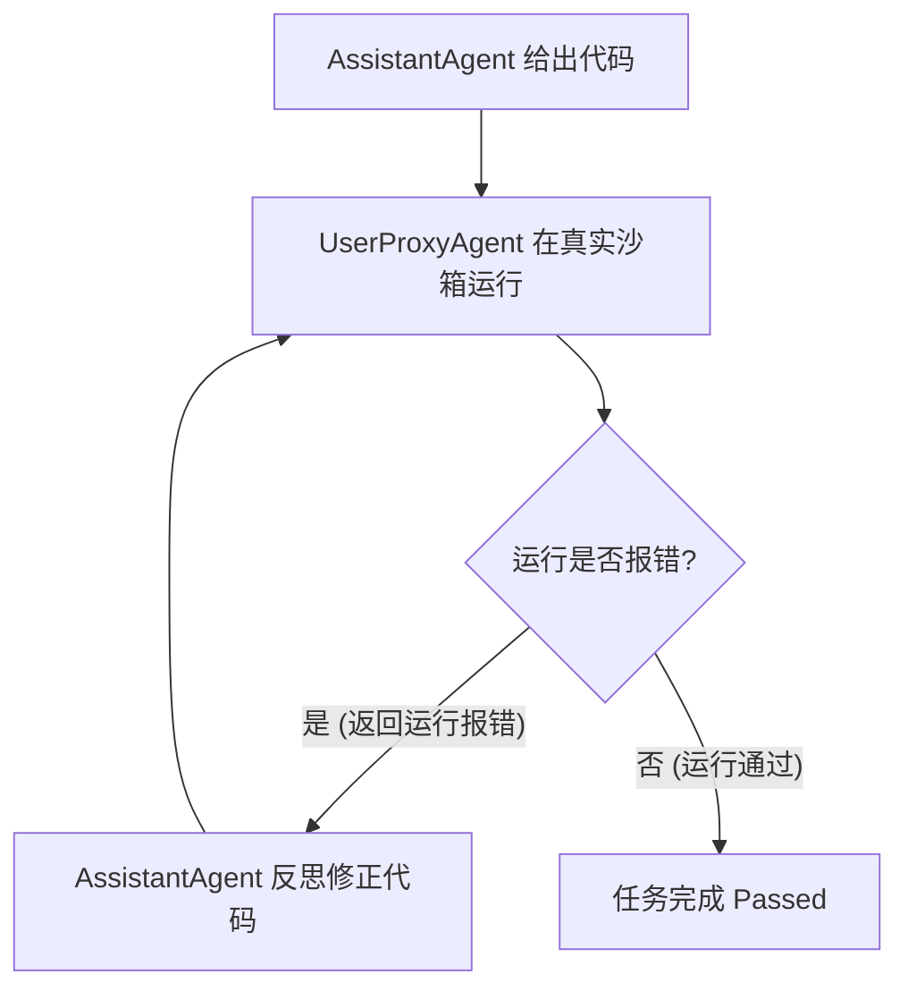

## 一、 CAMEL：多智能体协同的学术启蒙

**CAMEL (Role-Playing)** 是多智能体协同领域的鼻祖级学术框架。它首次向世界证明：**通过给不同的大模型分配特定角色，它们可以在完全无需人类干优的情况下，通过自主对谈完美合力解决极其复杂的任务。**

### 📌 1. 设计哲学

* **Role-Playing（角色扮演与镜像对齐）**：将复杂任务拆解为 **AI User Agent**（需求/指令方，如产品经理）与 **AI Assistant Agent**（执行/解答方，如程序员）。两者通过互为镜像的一问一答（击鼓传花式对话）来推进任务。

### ⚙️ 2. 核心技术：Inception Prompting（启蒙提示词）

* **痛点**：两个模型自主对话极易陷入无限的“社交套客气话”死循环。
* **机制**：在系统底层为双方植入强硬的行为钢印：
  * **强制约束 AI User**：“你只准发具体的、可执行的下一步指令，严禁寒暄，不准解决具体问题。”
  * **强制约束 AI Assistant**：“你只准针对指令给出解答和代码，绝对不准问多余的废话和寒暄。”
* **效果**：将两个模型的对话路径强制限制在一条**“需求 ➡️ 交付”的高速公路**上。

### 🎯 3. 适用与评价

* **✅ 优势**：极具对称美学，完全自主闭环，首创了多角色分工协同的范式。
* **❌ 局限**：控制流完全自主（易脱轨）、Token 成本高、偏学术研究，难以直接落地严肃商业项目。
* **💡 最佳场景**：学术研究、多角色自动对决、生成复杂闭环文本/代码的探索。

---

## 二、 AutoGen：代码执行与自动纠错的先锋

**AutoGen** 是由微软（Microsoft）团队开源的、以“对话（Conversation）”为核心、原生内置代码执行能力的顶级多智能体协同框架。

### 📌 1. 设计哲学：智能体即对话伙伴（Conversable）

* AutoGen 认为，多智能体协同的本质是“群聊”。所有的 Agent 都是 `ConversableAgent` 的派生类。
* 任务的流转不依赖传统的代码硬编码逻辑，而是依赖智能体在群聊里发送的“文本消息”。

### ⚙️ 2. 核心“脑手协同”模型

* **AssistantAgent (脑)**：由大语言模型（LLM）驱动，负责理解任务、编写 Python 脚本和出谋划策。
* **UserProxyAgent (手)**：在默认情况下**不配置任何 LLM**。它内置了**代码执行器（Code Executor）**，专门负责自动提取对话中的代码并在本地或 Docker 沙箱中运行，然后将报错信息直接作为 User 消息返回给 AssistantAgent。

### 🔄 3. 经典代码自动排错闭环



### 🎯 4. 适用与评价

* **✅ 优势**：原生内置强大的代码执行沙箱与自动修 Bug 机制。支持 **Group Chat（动态群聊）**，由一个大模型驱动的 `GroupChatManager` 动态决定谁说下一句话，灵活性极高。
* **❌ 局限**：大模型自主决定群聊顺序在生产环境中具有极强的不确定性，容易陷入死循环。
* **💡 最佳场景**：自动化软件研发（R&D）、自适应数据分析与画图、代码库自动重构。

---

## 三、 AgentScope：高性能与管道化编程

**AgentScope** 是由阿里巴巴（Alibaba）团队开源的、专为“易用性、企业级高可用、分布式高并发”打造的下一代多智能体应用平台。

### 📌 1. 设计哲学：易用性、高性能与分布式高可用

* 针对大型智能体应用（如智能客服大厅、多 NPC 游戏小镇）中多并发、慢响应的痛点，采用类似 **Actor 模型的异步通信底座**，支持多机分布式部署。
* 内置了极其强悍的工业级高可用机制，包含自动重试、大模型 API 负载均衡、状态备份与恢复。

### ⚙️ 2. 核心技术：Pipeline（管道化函数式编程）

* AgentScope 摒弃了复杂的跳转配置，独创了 **Pipeline** 编程范式，将 Agent 之间的对话和数据传递抽象为函数式流动：
  * **线性流 (`sequentialpipeline`)**：

        ```python
        # 消息自动在 planner -> coder -> tester 之间链式加工
        sequentialpipeline([planner, coder, tester])(msg)
        ```

  * **并行/广播流 (`joinpipeline`)**：

        ```python
        # 并行广播给三个专家，并自动合并其评审意见
        feedback = joinpipeline([expert1, expert2, expert3])(code_msg)
        ```

### 🖥️ 3. 可视化调试利器：AgentScope Portal

* 提供了极具科技感的可视化 Web Portal。将 Agent 后台繁杂的“脑内风暴”、悄悄话和工具调用流，以可视化的实时拓扑节点图直观展现，极大降低了 Debug 难度。

### 🎯 4. 适用与评价

* **✅ 优势**：高并发异步性能极强（适合大规模 Agent 协同）、管道化代码非常优雅、Portal 演示效果极佳。
* **❌ 局限**：对于高合规性的严格分支状态机业务，其自由管道的控制力不如 LangGraph。
* **💡 最佳场景**：大规模分布式 NPC 协同、大型多模态智能体平台、高性能并发客服。

---

## 四、 LangGraph：严谨有状态的确定性状态机

**LangGraph** 是由 LangChain 团队推出的一款用于构建 **有状态、支持循环路由、高可控性** 智能体的工业级编排框架。

### 📌 1. 设计哲学：彻底打破 LCEL 表达式的“线性单向局限”

* 大模型的反思、ReAct、Tool-Use 天然需要“循环/回路”。而 LangChain 原本的 DAG（有向无环图）是不支持回滚的。
* LangGraph 将智能体应用完全抽象为一个**“有状态的状态机（State Machine）”**。

### ⚙️ 2. 核心铁三角架构

* **State (全局状态)**：一个全局共享、只增不减的数据结构，代表图的当前记忆与上下文状态。
* **Nodes (节点)**：具体的处理函数。它接收当前的 State，运行一些逻辑（如调用 LLM），并返回状态的增量字典。
* **Edges (边)**：路由决策器。
  * **普通边**：确定性跳转。
  * **条件边 (Conditional Edges)**：路由函数读取当前 State，由大模型或逻辑动态决定下一步跳转回哪个节点（实现循环回滚）。

### 💎 3. 杀手级机制：Checkpointer（检查点与时空穿梭）

* **完美的 Human-in-the-loop (人工审批)**：通过在条件边设置 `interrupt_before` 断点，图运行到此处会自动存盘数据库并挂起。人类审核通过或注入意见后，一键 `resume` 恢复运行。
* **Time Travel (时空穿梭)**：支持在代码中随时回滚状态到历史的任意版本号，在此分支上开辟全新的生成路径，非常利于调试。

### 🎯 4. 适用与评价

* **✅ 优势**：企业级可控性无可替代，数据流 100% 严密安全，状态机制极为高级。
* **❌ 局限**：上手门槛较高，需要手画节点和条件边，对于高度自由和探索性的任务显得过于死板。
* **💡 最佳场景**：企业级严肃业务（金融信贷审批、合规风险审计、自动化 SOP 数字化）。

---

## 五、 四大框架终极对比矩阵

| 维度 | CAMEL | AutoGen | AgentScope | LangGraph |
| :--- | :--- | :--- | :--- | :--- |
| **主导厂商** | 学术界 (KAUST) | 微软 (Microsoft) | 阿里巴巴 (Alibaba) | LangChain 团队 |
| **认知核心** | **自主角色扮演对谈** | **自主动态群聊** | **函数式管道化流动** | **确定性有状态状态机** |
| **控制流可控度** | 极低（完全自主聊天） | 中等（依靠群聊选择器） | 中到高（依靠 Pipeline 链路） | **极高**（完全由 Edge 与 Node 定死） |
| **状态/记忆管理** | 离散，各 Agent 自带 | 离散，各 Agent 自带 | 集中，基于 Message 数组流动 | **极强**（全局共享的持久化 State） |
| **代码执行 sandbox** | 无 | **极强（原生内置）** | 一般 | 一般（需通过 Tool 自定义传入） |
| **高并发与分布式** | 无（同步模型） | 弱（单机单线程模型） | **极强（原生 Actor 异步设计）** | 一般（依赖外部数据库） |
| **人工接入 (HITL)** | 无 | 强（UserProxy 终端阻断） | 一般 | **完美**（Checkpointer 持久化中断） |
| **开发编程难度** | 极低 | 中等 | **极低（Pipeline 非常丝滑）** | 较高（有画图和状态合并心智负担） |

---

## 六、 智能体架构师选型黄金法则

在实际工程落地中，面对不同的业务场景，应采取不同的选型策略：

> ### 🚀 1. 【代码开发、自动 Debug、自适应数据探索】场景
>
> * **首选框架**：**AutoGen**
> * **核心理由**：其内置的 `UserProxyAgent` 配合本地/Docker 代码执行沙箱（Sandbox），能够自我反思、死磕 Bug 直至运行成功，形成完美的自动闭环。

> ### ⚡ 2. 【高并发商业平台、大规模多模态智能体、需要可视化汇报】场景
>
> * **首选框架**：**AgentScope**
> * **核心理由**：其分布式 Actor 异步底座天然支持高并发多机部署，Pipeline 极大地提升了开发效率，且配备的 Web Portal 拓扑图可视化效果极具商业演示说服力。

> ### 🛡️ 3. 【严肃金融业务、法律合规、流程严密的 SOP 业务】场景
>
> * **首选框架**：**LangGraph**
> * **核心理由**：提供 100% 确定性的有状态 DAG 控制流，独有的 Checkpointer 机制完美解决人工审批（Human-in-the-loop）和任意节点状态回滚，切实保障业务与资金合规安全。
